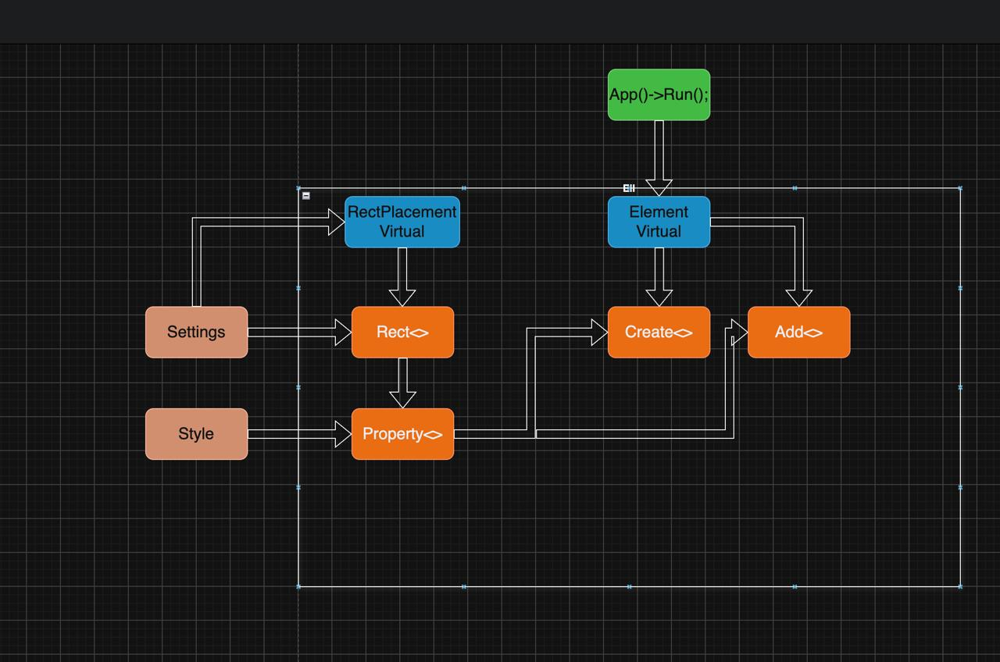

# Letter

As you may have already guessed, the project is called “Letter.” I thought long and hard about the name—that usually takes me the longest—but I settled on this one.

## About the project

In this project, I am developing my own graphics library that interacts with the system API and provides a convenient interface via C++ (that was the plan).

The project is still in the early stages of development; its architecture is still being worked out at this point.

For now, the organizational chart looks like this.

